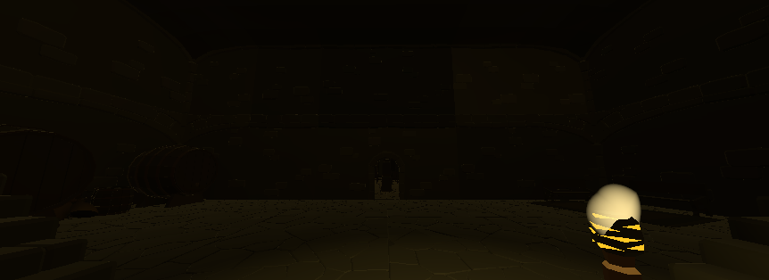
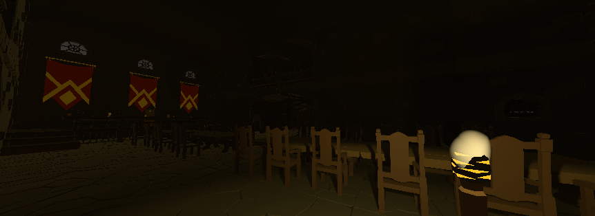
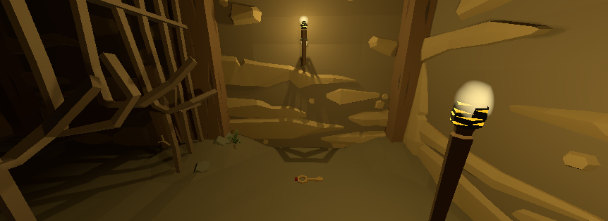
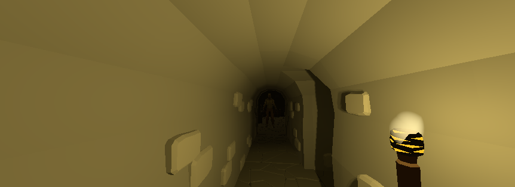
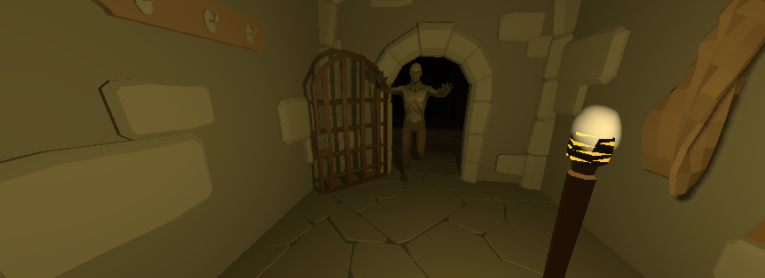

# Escape the Dungeon

> Jogo de terror feito para a avaliação de computação gráfica

## Estudante

**Nome:** Matheus Miranda | **Código:** 22655

## Sobre o Jogo

> Após se encontrar preso dentro de uma dungeon, você deve achar a chave que está escondida dentro e retornar à porta de entrada para escapar, mas cuidado, você não está sozinho...

> **OBJETIVO:** Encontre a chave escondida dentro da dungeon e retorne à porta de entrada.

### Vídeo de Demonstração

> Se o video não estiver tocando, clique nele e clique no view raw. Não sei como concertar o problema.

### Prints de Demonstração

## Áreas da Computação Gráfica Utilizadas

* **Modelagem 3D:** Usado para renderizar os personagens, itens e cenários do jogo;

* **Animação:** Utilizada a tela de animator para animar os movimentos do zumbi (idle, run e attack);

* **Iluminação:** Usada na tocha que o personagem principal usa para que ele possa ver melhor o que esta na sua frente;

## Assets utilizados

[Ultimate Low Poly Dungeon](https://assetstore.unity.com/packages/3d/environments/dungeons/ultimate-low-poly-dungeon-143535)

> Usado para o mapa e para o personagem do jodador e como ele é controlado;

[Zombie](https://assetstore.unity.com/packages/3d/characters/humanoids/zombie-30232)

> Usado para o zumbi e para as suas animações;

## Problemas com o jogo conhecidos

* **Falta de audio:** O jogo não possui nehuma forma de audio;

* **Zumbis ficando presos nas paredes:** Não é dificil para os zumbis ficarem presos correndo nas paredes, especialmente o primeiro zumbi;

## Colaboradores

<table>
  <tr>
    <td align="center">
      <a href="https://github.com/MatheusMiranda1" target="_blank">
         
        
          <b>Matheus Miranda</b>
        
      </a>
    </td>
  </tr>
</table>

## License
The MIT License (MIT)

Copyright (c) 2023 Matheus Miranda

Permission is hereby granted, free of charge, to any person obtaining a copy of this software and associated documentation files (the "Software"), to deal in the Software without restriction, including without limitation the rights to use, copy, modify, merge, publish, distribute, sublicense, and/or sell copies of the Software, and to permit persons to whom the Software is furnished to do so, subject to the following conditions:

The above copyright notice and this permission notice shall be included in all copies or substantial portions of the Software.

THE SOFTWARE IS PROVIDED "AS IS", WITHOUT WARRANTY OF ANY KIND, EXPRESS OR IMPLIED, INCLUDING BUT NOT LIMITED TO THE WARRANTIES OF MERCHANTABILITY, FITNESS FOR A PARTICULAR PURPOSE AND NONINFRINGEMENT. IN NO EVENT SHALL THE AUTHORS OR COPYRIGHT HOLDERS BE LIABLE FOR ANY CLAIM, DAMAGES OR OTHER LIABILITY, WHETHER IN AN ACTION OF CONTRACT, TORT OR OTHERWISE, ARISING FROM, OUT OF OR IN CONNECTION WITH THE SOFTWARE OR THE USE OR OTHER DEALINGS IN THE SOFTWARE.
